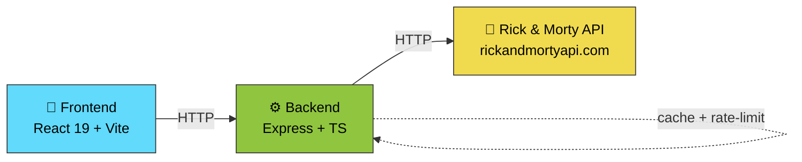

# 🚀 Rick and Morty Explorer

**Buscador y explorador de personajes de Rick and Morty** con backend propio que actúa como proxy y normalizador de la API pública. Incluye búsqueda con debounce, paginación de servidor, caché estratégica y rate-limiting.

---

## 📋 Requisitos previos

- **Node.js** v22+
- **pnpm** (gestor de paquetes recomendado)

---

## 🏗️ Arquitectura



**Flujo:**
- El **frontend nunca llama directo** a `rickandmortyapi.com`
- **Backend actúa como proxy** con caché en memoria y rate-limiting (100 req/min por defecto)
- **Respuestas normalizadas** y paginadas en ambas capas

### Stack Tecnológico

| Componente | Techs |
|-----------|-------|
| **Frontend** | React 19, Vite, TypeScript, Tailwind CSS v4, react-router v8 |
| **Backend** | Express 4, TypeScript (ESM), Vitest, Supertest |
| **Testing** | Vitest + Testing Library (frontend), Supertest (backend), Playwright (e2e) |
| **Herramientas** | oxlint (linter), oxfmt (formatter), tsx, pnpm workspaces |

---

## 🚀 Arranque rápido (Recomendado)

Desde la **raíz del proyecto**, con una sola terminal:

```powershell
# Instalar dependencias en backend/ y frontend/
pnpm install:all

# Levantar backend + frontend simultáneamente con concurrently
pnpm dev

# (En otra terminal) Formatear el código
pnpm format
```

- Backend: `http://localhost:3001` (terminal azul)
- Frontend: `http://localhost:5173` (terminal magenta)

**Nota:** Este comando ejecuta `pnpm --dir backend dev` + `pnpm --dir frontend dev` en paralelo. Todos los comandos principales (`dev`, `test`, `build`, `lint`, `format`) se pueden ejecutar desde la raíz.

---

## 🔧 Arranque manual (Alternativa, dos terminales)

### Terminal 1: Backend

```powershell
cd backend
Copy-Item .env.example .env
pnpm install
pnpm dev
```

Levanta en `http://localhost:3001`.

### Terminal 2: Frontend

```powershell
cd frontend
Copy-Item .env.example .env
pnpm install
pnpm dev
```

Levanta en `http://localhost:5173`.

---

## 🌍 Variables de entorno

Copiar `.env.example` a `.env` en cada carpeta y ajustar según necesidad.

### Backend (`.env`)

| Variable | Default | Descripción |
|----------|---------|-------------|
| `PORT` | `3001` | Puerto del servidor Express |
| `CORS_ORIGIN` | `http://localhost:5173` | Origin permitido para CORS (frontend) |
| `UPSTREAM_BASE_URL` | `https://rickandmortyapi.com/api` | Base URL de la API pública |
| `RATE_LIMIT_MAX` | `100` | Máximo de requests por ventana |
| `RATE_LIMIT_WINDOW_MS` | `60000` | Ventana de tiempo (ms) para rate-limit |

### Frontend (`.env`)

| Variable | Default | Descripción |
|----------|---------|-------------|
| `VITE_API_URL` | `http://localhost:3001` | URL del backend propio |

---

## 📡 Endpoints del backend

### Listado de personajes

```
GET /characters?name=&page=
```

| Parámetro | Tipo | Descripción |
|-----------|------|-------------|
| `name` | string (opt) | Filtro parcial por nombre (max 100 chars) |
| `page` | number (opt) | Número de página (1-based) |

**Respuesta 200 (éxito):**
```json
{
  "info": {
    "count": 826,
    "pages": 42,
    "next": "...",
    "prev": null
  },
  "results": [...]
}
```

**Códigos de respuesta:**
- `200` — OK (incluso si `name` sin match o `page` fuera de rango → `results: []`)
- `400` — `name` > 100 chars o `page` no numérico
- `429` — Rate-limit excedido
- `500` — Error interno del servidor

### Detalle de personaje

```
GET /characters/:id
```

| Parámetro | Tipo | Descripción |
|-----------|------|-------------|
| `id` | number | ID del personaje |

**Respuesta 200:**
```json
{
  "id": 1,
  "name": "Rick Sanchez",
  "status": "Alive",
  "...": "..."
}
```

**Códigos de respuesta:**
- `200` — OK
- `400` — `id` no numérico
- `404` — `id` inexistente
- `429` — Rate-limit excedido
- `500` — Error interno

---

## 🗺️ Rutas del frontend

| Ruta | Descripción |
|------|-------------|
| `/` | **Listado con búsqueda y paginación.** El estado (`?name=...&page=...`) persiste en la URL, es bookmarkeable y sobrevive a recargas. |
| `/character/:id` | **Detalle del personaje.** La URL conserva `?name=&page=` de la búsqueda anterior. El botón "volver" reconstruye `/` con los mismos parámetros — funciona incluso si se recarga o se accede directo por URL. |

---

## 📁 Estructura de carpetas

```
.
├── backend/
│   ├── src/
│   │   ├── app.ts               # Configuración de Express (middlewares, rutas)
│   │   ├── server.ts            # Punto de entrada
│   │   ├── routes/              # Endpoints: /characters, /characters/:id
│   │   ├── services/            # Lógica: rickAndMorty.service.ts, cache.ts
│   │   ├── middlewares/         # CORS, rate-limit, error handling
│   │   ├── validators/          # Validadores: characters.validators.ts
│   │   └── types/               # DTOs y tipos TypeScript
│   └── package.json             # Scripts: dev, test, typecheck, lint
│
├── frontend/
│   ├── src/
│   │   └── features/
│   │       └── characters/      # Feature autónoma
│   │           ├── components/  # UI: CharacterCard, SearchBar, etc.
│   │           ├── hooks/       # Hooks: useCharacter, useCharacterSearch, useBackToList, etc.
│   │           ├── pages/       # Páginas: Home, CharacterDetail
│   │           ├── services/    # Fetching: API client
│   │           └── types.ts     # DTOs y tipos
│   └── package.json             # Scripts: dev, build, test, lint
│
├── e2e/
│   ├── tests/                   # Tests Playwright
│   ├── playwright.config.ts     # Configuración
│   └── package.json             # Script: test:e2e
│
├── pnpm-workspace.yaml          # Workspace root
├── package.json                 # Scripts raíz: dev, install:all, test, build
└── README.md
```

---

## 🧪 Testing

### Backend (Vitest + Supertest)

```powershell
cd backend
pnpm test           # Corre 22 tests
pnpm typecheck      # Verifica tipos
pnpm lint           # oxlint
```

**Cobertura:** Endpoints de listado y detalle con validación, rate-limit, errores.

### Frontend (Vitest + Testing Library)

```powershell
cd frontend
pnpm test           # Corre 8 tests
pnpm lint           # oxlint
```

**Nota:** El chequeo de tipos (`tsc -b`) está integrado en `pnpm build`.

### End-to-End (Playwright)

```powershell
cd e2e
pnpm install
pnpm exec playwright install chromium
pnpm test:e2e       # 3 tests (con mock del upstream rickandmortyapi.com)
```

**Nota:** El mock del upstream hace que los tests sean deterministas y no dependan de la API pública real.

### Suite completa desde la raíz

```powershell
# Corre unitarios (backend + frontend)
pnpm test

# Corre e2e
pnpm test:e2e

# Corre todo: unitarios + e2e
pnpm test:all
```

---

## 📜 Scripts disponibles

### Raíz (`package.json`)

| Script | Acción |
|--------|--------|
| `pnpm dev` | Levanta backend + frontend en paralelo (concurrently) |
| `pnpm install:all` | Instala deps en `backend/` y `frontend/` |
| `pnpm test` | Corre tests unitarios de backend (Vitest, 23) + frontend (Vitest, 8) |
| `pnpm test:e2e` | Corre tests e2e de Playwright (3 tests, con mock del upstream) |
| `pnpm test:all` | Corre `test` + `test:e2e` (suite completa) |
| `pnpm build` | Build frontend (Vite + tsc gate) |
| `pnpm lint` | oxlint en backend y frontend |
| `pnpm format` | oxfmt in-place en backend, frontend y e2e |
| `pnpm format:check` | oxfmt --check en backend, frontend y e2e (verifica sin escribir) |

### Backend (`backend/package.json`)

| Script | Acción |
|--------|--------|
| `pnpm dev` | Levanta servidor con `tsx watch` |
| `pnpm test` | Corre suite Vitest (23 tests) |
| `pnpm typecheck` | `tsc --noEmit` |
| `pnpm lint` | oxlint |
| `pnpm format` | oxfmt (formatea in-place) |
| `pnpm format:check` | oxfmt --check (verifica sin escribir) |

### Frontend (`frontend/package.json`)

| Script | Acción |
|--------|--------|
| `pnpm dev` | Vite en modo desarrollo |
| `pnpm build` | `tsc -b` + `vite build` |
| `pnpm test` | Vitest (8 tests) |
| `pnpm lint` | oxlint |
| `pnpm format` | oxfmt (formatea in-place) |
| `pnpm format:check` | oxfmt --check (verifica sin escribir) |
| `pnpm preview` | Preview de la build |

### E2E (`e2e/package.json`)

| Script | Acción |
|--------|--------|
| `pnpm test:e2e` | Playwright (3 tests, con mock del upstream) |
| `pnpm format` | oxfmt (formatea in-place) |
| `pnpm format:check` | oxfmt --check (verifica sin escribir) |

---

## ✨ Características destacadas

- ✅ **Búsqueda con debounce** (300ms) para no saturar el backend
- ✅ **Paginación de servidor** integrada en la API
- ✅ **Caché en memoria** en el backend (estrategia configurable)
- ✅ **Rate-limiting** (100 req/min, evita abuso de API pública)
- ✅ **URL bookmarkeable** — guarda estado (`?name=&page=`) en query params
- ✅ **Volver conservando contexto** — el botón de atrás reconstruye la búsqueda exacta
- ✅ **Estados UI** — loading, error, empty state, detalle
- ✅ **TypeScript en ambas capas** para type safety
- ✅ **Testing** — backend (Vitest+Supertest), frontend (Vitest+Testing Lib), e2e (Playwright)

---

## 🔐 Notas de seguridad

- El **rate-limit** en el backend protege la API pública de abuso
- Las **credenciales/tokens** (si las hubiera) van en `.env`, nunca en el código
- Los `.env.example` documentan qué variables se necesitan

---

## 📝 Licencia

Proyecto académico — prueba técnica de Vue/React explorer con Node.js backend.
